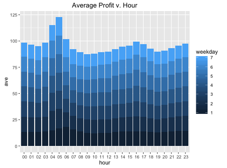
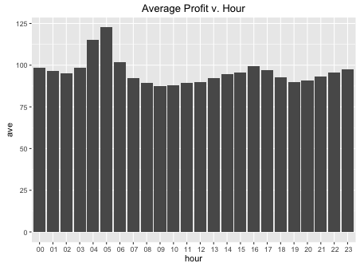
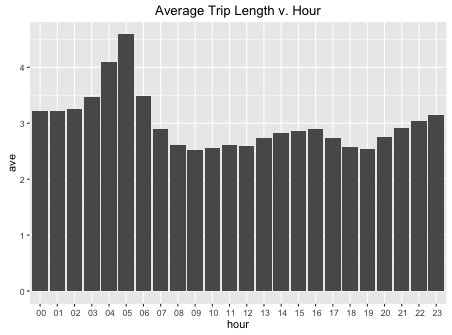
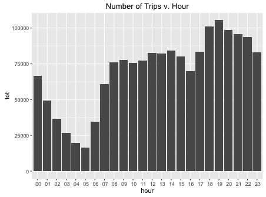

# New York Taxi Services {#slide}

With the emergence of services like Uber and Lyft, how can taxi drivers remain competitive?

  

  

  Questions
  

  

  Where and when should taxis be allocated in order for taxi drivers to...
  

  - maximize the number of rides?
  - maximize the amount of fare collected?
  

  

  

  

  

  Data
  

  

  Time Period: 2009 - 2015\
  Variables:
  

  - Time
  - Trip Length
  - Fare
  - Location
  

  

  

Data Source: <i>http://www.nyc.gov/html/tlc/html/about/trip_record_data.shtml</i>

# Results: Time, Trip Length, Fare {#slide}

  Early morning trips net the most profit
  

  - Less trips taken
  - Greater distance traveled
  

  
  

  When broken down by weekday, results appear consistent.
  

# Location {#slide}

  

  Distribution of sample of pickup location data. Highlighted is the most active area for taxi pickups.
  

  

  
  

